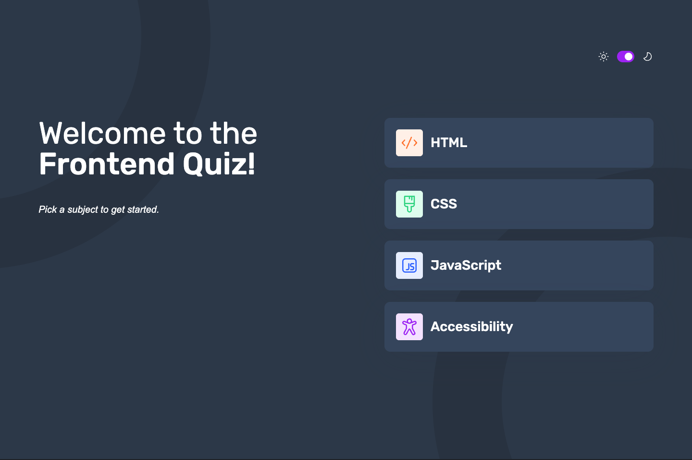

# Frontend Quiz App

This app dynamically loads quiz data to test frontend knowledge in 4 key areas: HTML, CSS, JavaScript, and Accessibility.



[Live Demo](https://mattjm1007.github.io/Frontend-Quiz-App/) · [View Code](https://github.com/MattJM1007/Frontend-Quiz-App)

---

## Overview

This app dynamically loads quiz data based on the user-selected topic. Each answer submission shows whether the choice was correct or incorrect, and the user's score is recorded and displayed upon finishing the quiz.

---

## Features

- Change the app's theme between light and dark
- Select a quiz subject
- Select a single answer from each question from a choice of four
- See an error message when trying to submit an answer without making a selection
- See if they have made a correct or incorrect choice when they submit an answer
- Move on to the next question after seeing the question result
- See a completed state with the score after the final question
- Play again to choose another subject

---

## Technical Highlights

**Theme Switcher with System Preference**

The theme switcher checks for a saved preference in localStorage first, then falls back to the user's system preference using `window.matchMedia`. This means the app respects the user's OS-level dark/light mode setting automatically. The active theme is stored on the `<html>` element as a `data-theme` attribute, and the CSS `light-dark()` function handles color switching without needing duplicate property declarations.

**Answer State Driven by CSS**

Rather than toggling classes with JavaScript to style correct and incorrect answers, the answer state is driven by `:has()` and sibling selectors in CSS. JavaScript adds a single class to the selected answer, and CSS handles all the visual feedback from there — including highlighting the correct answer when a wrong one is chosen.

---

## Tech Stack

- Semantic HTML
- CSS (custom properties, `light-dark()`, `:has()`, sibling selectors)
- JavaScript (ES6+, `localStorage`, `fetch`, async/await)

---

## Getting Started

```bash
git clone https://github.com/MattJM1007/Frontend-Quiz-App
```

This is a vanilla JS project with no build step. Clone the repo and open `index.html` in your browser.

---

## Challenges & What I Learned

**Managing quiz state across multiple views**

The app has several distinct states — topic selection, active question, answer submitted, and results — and keeping track of what should be shown or hidden at each stage was the most complex part. I learned to keep state in JavaScript variables rather than reading it back from the DOM, which made the logic easier to reason about and less error-prone.

**Styling answer feedback without JavaScript-heavy logic**

I wanted correct and incorrect answers to be visually distinct after submission, including showing the correct answer when the user picks the wrong one. Reaching for CSS `:has()` and sibling selectors — the same pattern I used in other projects — let me keep the JavaScript focused on logic and let CSS handle the visual output.

---

## What I'd Improve

**Improved state management**

With this quiz having multiple states, I would move this to a React app where I could dynamically update the state variable and display the correct content. This would make the logic easier to reason about and less error-prone.

**Break up large functions**

Some functions handle more than one responsibility. For example, the answer submission handler both validates the selection and updates the UI. I would split these into smaller, single-purpose functions to make the code easier to test and maintain.
